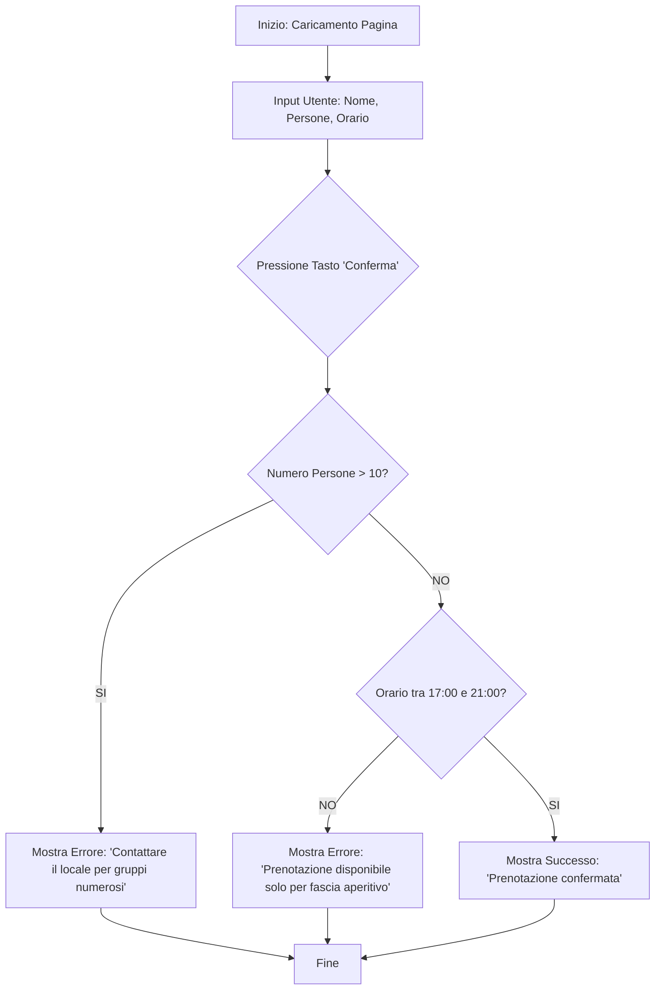

# Documento Architetturale dell'Applicativo - OttoCN Reservation System

## Diagramma di Flusso Logico

## Specifiche dell'Applicativo

### Input dell'applicativo
- **Nome Cliente**: Stringa (obbligatorio)
- **Numero Persone**: Numero intero (minimo 1)
- **Data**: Formato data (obbligatorio)
- **Orario**: Formato orario (HH:MM)

### Controlli Logici e Condizioni
1. **Soglia Gruppi**: Se `numero_persone > 10`, viene bloccata la prenotazione automatica.
2. **Validazione Orario**: L'orario inserito deve essere compreso nell'intervallo `[17:00, 21:00]` per tutti i giorni.

### Principali Elaborazioni
- Parsing dei dati dal modulo HTML.
- Confronto stringhe per l'orario (sfruttando il formato ISO delle ore).
- Manipolazione del DOM per mostrare feedback visivo dinamico (successo/errore) senza ricaricare la pagina.

### Output o Risultati Restituiti
- Messaggio di errore in rosso per input non validi.
- Messaggio di conferma in verde con riepilogo dei dati (Nome, Persone, Orario) per prenotazioni andate a buon fine.
